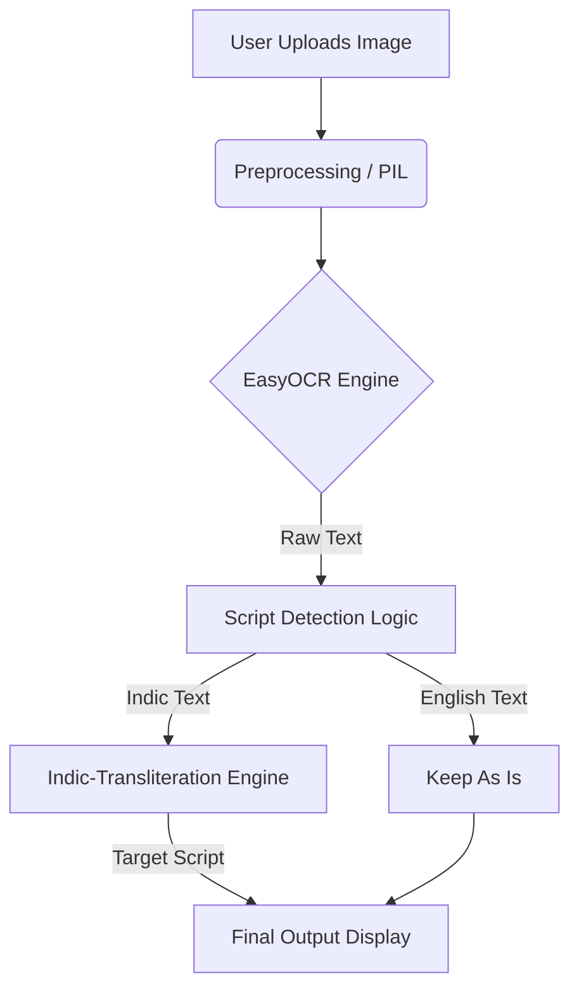

# 🛣️ IndicLens

> **Bridging the gap between Indian scripts and global travelers.**

**IndicLens** is an open-source web application designed to detect and transliterate multilingual **Indian street signboards** into user-selected Indic scripts.

Built using **Streamlit**, **EasyOCR**, and **Indic-Transliteration**, this tool demonstrates how AI and NLP can bridge linguistic barriers across India’s diverse language landscape.

*(Please replace the link above with an actual screenshot of your app)*

---

## 📘 Overview

India is a land of many scripts. A traveler from Tamil Nadu visiting Uttar Pradesh might understand Hindi *spoken* words but cannot read the Devanagari *script*.

**IndicLens** solves this by focusing on **Transliteration** (Script Conversion) rather than just Translation. It allows users to read street signs in their own familiar script, making navigation easier and more accessible.

---

## 🧠 Features

✅ **Multilingual OCR** Detects and reads text in **English**, **Hindi**, **Tamil**, and **Telugu** using EasyOCR.

✅ **Intelligent Transliteration** Automatically identifies the script and transliterates only Indic lines into your chosen target script (e.g., converts Hindi text to Telugu script).

✅ **Fast & Optimized** Uses `st.cache_resource` to cache OCR models and prevent memory crashes or reload delays.

✅ **User-Friendly Streamlit UI** - Upload or test with a sample image.
- Choose your target script.
- Instantly view and copy the transliterated output.

✅ **Deployment-Ready** Lightweight dependencies, fully compatible with **Streamlit Cloud** and **Hugging Face Spaces**.

---

## ⚙️ Tech Stack

| Component | Technology Used |
|------------|-----------------|
| **Frontend** | Streamlit (Python) |
| **OCR Engine** | EasyOCR (PyTorch backend) |
| **Transliteration** | Indic-Transliteration Library |
| **Image Processing** | Pillow (PIL) |
| **Supported Scripts** | English, Hindi, Tamil, Telugu |

---

## 🧩 How It Works

1. **Upload:** User uploads a street sign image (or uses the example).
2. **Extraction:** The app runs **EasyOCR** to extract all visible text.
3. **Filtering:** A logic layer detects which text lines are in Indic scripts.
4. **Conversion:** These lines are **transliterated** into the user's selected script.
5. **Output:** The text is displayed ready for reading or copying.

---

## 🧠 Architecture

🔮 Future Scope
Integration with Bhashini-IITJ: Planning to integrate specialized IndicPhotoOCR models to improve accuracy on curved and blurry text.

Real-time Video: Implementing live camera feed processing for mobile users.

Voice Output: Adding Text-to-Speech (TTS) so users can hear the pronunciation.
📦 Installation & Setup
Want to run this locally? Follow these steps:

Clone the repository

Bash
----------------------------------------------------------------------------------------------
git clone [https://github.com/07adii04/IndicLens.git](https://github.com/07adii04/IndicLens.git)
cd IndicLens
Install dependencies
------------------------------------------------------------------------------------------------
Bash
----------------------------------------------------------------------------------------------
pip install -r requirements.txt
Run the app

Bash
-----------------------------------------------------------------------------------------------
streamlit run app.py
------------------------------------------------------------------------------------------------
👨‍💻 Author
Aditya aiml student @ MIPS

(https://www.linkedin.com/in/aditya-tiwari-b2866a333/)

⭐ Star this repo if you find it useful!
